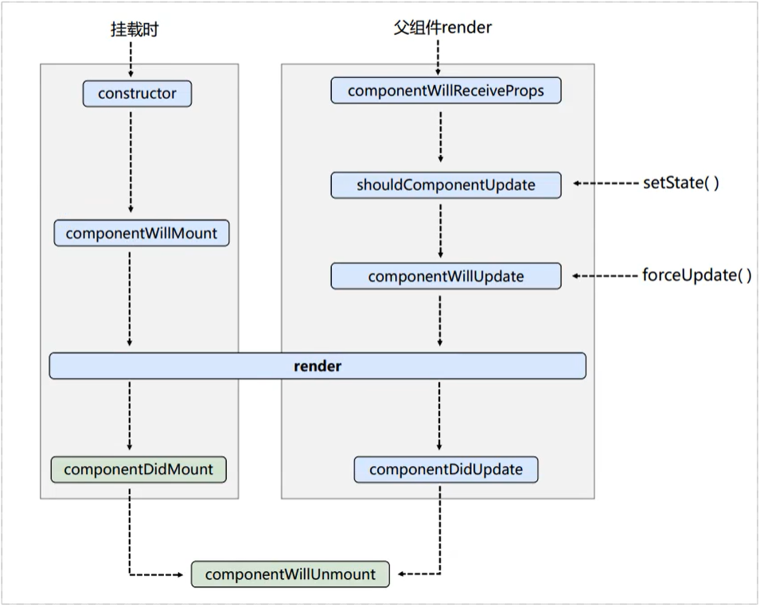

<html>
<head>
  <title>Evernote Export</title>
  <basefont face="微软雅黑" size="2" />
  <meta http-equiv="Content-Type" content="text/html;charset=utf-8" />
  <meta name="exporter-version" content="YXBJ Windows/604762 (zh-CN, DDL); Windows/10.0.0 (Win64); EDAMVersion=V2;"/>
  
</head>
<body>
<a name="593"/>

 

&lt;!-- 直接引入react 并简单渲染一个页面 --&gt;

&lt;!DOCTYPE html&gt;

&lt;html lang=&quot;en&quot;&gt;

&lt;head&gt;

    &lt;meta charset=&quot;UTF-8&quot;&gt;

    &lt;meta http-equiv=&quot;X-UA-Compatible&quot; content=&quot;IE=edge&quot;&gt;

    &lt;meta name=&quot;viewport&quot; content=&quot;width=device-width, initial-scale=1.0&quot;&gt;

    &lt;title&gt;hello react&lt;/title&gt;

&lt;/head&gt;

&lt;body&gt;

    &lt;!-- 容器 --&gt;

    &lt;div id=&quot;myDiv&quot;&gt;&lt;/div&gt;

&lt;/body&gt;

&lt;!-- react核心库 --&gt;

&lt;script src=&quot;./js/react.development.js&quot; &gt;&lt;/script&gt;

&lt;!-- react-DOM 用于支持react操作DOM --&gt;

&lt;script src=&quot;./js/react-dom.development. js&quot;&gt;&lt;/script&gt;

&lt;!-- babel 将jsx转化为普通js --&gt;

&lt;script src=&quot;./js/babel.min.js&quot;&gt;&lt;/script&gt;

&lt;!-- type要写成 text/babel --&gt;

&lt;script type=&quot;text/babel&quot;&gt;

    let inner= &lt;h1&gt;hello React&lt;/h1&gt;

    let ele = document.getElementById('myDiv')

    ReactDOM.render(inner,ele)

&lt;/script&gt;

&lt;/html&gt;

关于虚拟DOM

1、虚拟dom本质是obj类型的对象

2、虚拟dom比较轻（无过多内置方法），真是dom比较重，因为虚拟dom是react内部在用，无需真实dom上那么多属性。

3、虚拟DOM最终会被React转化为真是Dom，呈现在页面上。

<a name="851"/>

<ol><li>
JSX全称:  JavaScript XML是react定义的一种类似于XML的JS扩展语法: JS + XML本质是React.createElement(component, props, ...children)方法的语法糖 
</li><li>
 jSX语法规则 
</li></ol>
1、定义虚拟DOM时，不要写引号。

2、标签中混入JS表达式时要用{}。

3、样式的类名指定不要用class要用className

4、内联样式，要用style={{key:value}}的形式去写

5、只有一个根标签

6、标签必须闭合

7、标签首字母

    1）若小写字母开头，则将该标签转为html中同名元素，若html中无该标签对应的元素名，则报错

    2）若大写字母开头，react就去渲染对应的组件，若组件未定义，则报错。

一定注意区分：【JS语句】与【JS表达式】

  1.表达式：一个表达式会产生一个值。可以放在任何一个需要值的地方 如： 1==1

  2.语句（代码）：例如 if（）；for()；switch(){case：xxxx}

 

&lt;script type=&quot;text/babel&quot;&gt;

    let val = '啊哈哈哈哈'

    let name = 'test'

    let data = ['a','b','c','d']

    // 创建虚拟DOM

    let inner= (&lt;div&gt;

        &lt;h1 className='name' id={name} style={{padding:20+'px'}}&gt;

          &lt;span&gt;{val}&lt;/span&gt;

        &lt;/h1&gt;

        &lt;p&gt;这是内容&lt;/p&gt;

        &lt;input type=&quot;text&quot;/&gt;

        &lt;ul&gt;

            {

                data.map(item=&gt;{

                    return &lt;li key={item}&gt;{item}&lt;/li&gt;

                })

            }

        &lt;/ul&gt;

        &lt;/div&gt;)

    // 渲染虚拟DOM

    let ele = document.getElementById('myDiv')

    ReactDOM.render(inner,ele)

&lt;/script&gt;

 

<a name="853"/>

<h3 style="text-align: justify;">模块</h3><ol style="margin-top: 0mm; margin-bottom: 0mm; margin-left: 0mm; padding-left: 0pt;"><li style="margin-left: 36pt; margin-right: 0pt; padding-left: 3pt; text-indent: 0pt; font-size: 10.5pt;">
理解：向外提供特定功能的js程序, 一般就是一个js文件
</li><li style="margin-left: 36pt; margin-right: 0pt; padding-left: 3pt; text-indent: 0pt; font-size: 11pt;">
为什么要拆成模块：随着业务逻辑增加，代码越来越多且复杂。
</li><li style="margin-left: 36pt; margin-right: 0pt; padding-left: 3pt; text-indent: 0pt; font-size: 11pt;">
作用：复用js, 简化js的编写, 提高js运行效率.
</li></ol><h3 style="text-align: justify;">组件</h3><ol style="margin-top: 0mm; margin-bottom: 0mm; margin-left: 0mm; padding-left: 0pt;"><li style="margin-left: 36pt; margin-right: 0pt; padding-left: 3pt; text-indent: 0pt; font-size: 10.5pt;">
理解：用来实现局部功能效果的代码和资源的集合(html/css/js/image等等)
</li><li style="margin-left: 36pt; margin-right: 0pt; padding-left: 3pt; text-indent: 0pt; font-size: 11pt;">
为什么要用组件： 一个界面的功能更复杂
</li><li style="margin-left: 36pt; margin-right: 0pt; padding-left: 3pt; text-indent: 0pt; font-size: 11pt;">
作用：复用编码, 简化项目编码, 提高运行效率
</li></ol><h3>模块化</h3>
当应用的js都以模块来编写的, 这个应用就是一个模块化的应用

<h3>组件化</h3>
当应用是以多组件的方式实现, 这个应用就是一个组件化的应用

1、函数式组件

   执行了ReactDOM.render(&lt;FunComponent/&gt;,ele)后，发生了什么

           1）React解析组件标签，找到了FunCompontent组件。（组件的命名首字母要大写）

           2）发现组件是用函数定义的，随后调用该函数，将返回的虚拟DOM转为真实DOM，随后呈现在页面中。

 

&lt;script type=&quot;text/babel&quot;&gt;

// 创建函数式组件

    function FunComponent(){

        // 自定义函数里的this是undefined，因为babel编译后开启了严格模式，严格模式下，函数里的this指向都是undefined

        console.log(this)

        return &lt;h1&gt;测试函数式组件（简单组件）使用方法&lt;/h1&gt;

    }

    // 将组件渲染到页面

    let ele = document.getElementById('myDiv')

    ReactDOM.render(&lt;FunComponent/&gt;,ele)

    

&lt;/script&gt;

 

2、类式组件

执行了ReactDOM.render(&lt;MyComponent/&gt;,ele)后，发生了什么 

   1、React解析组件标签，找到了MyComponent组件

   2、发现组件是使用类定义的，随后new出来该类的实例，并通过该实例调用到原型上的render方法。

   3、将render返回的虚拟DOM转化为实际DOM，随后呈现到页面当中

 

&lt;script type=&quot;text/babel&quot;&gt;

//   创建一个函数式组件

class MyComponent extends React.Component{

    // render是放在--MyComponent的原型对象上，供实例使用

    // render中的this指向--MyComponent的实例对象 &lt;=&gt; MyComponent组件实例对象

    render(){

        return &lt;h1&gt;类定义的组件（适用于【复杂组件】的定义）&lt;/h1&gt;

    }

}

// 渲染到页面

let ele = document.getElementById('myDiv')

ReactDOM.render(&lt;MyComponent/&gt;,ele)

    

    

&lt;/script&gt;

 

 

<a name="855"/>

1、初始化state

    

&lt;!-- type要写成 text/babel --&gt;

&lt;script type=&quot;text/babel&quot;&gt;

    class Ppap extends React.Component{

        constructor(props){

            super(props)

            //初始化状态

            this.state={

                pen:true

            }

        }

        render(){

            //读取状态

            let {pen} = this.state

            return &lt;h1&gt;I have a {pen?'pen':'apple'}&lt;/h1&gt;

                    

        }

    }

    let ele = document.getElementById('myDiv')

    ReactDOM.render(&lt;Ppap/&gt;,ele)

&lt;/script&gt;

 

2、事件绑定  

使用 onClick进行绑定 

&lt;script type=&quot;text/babel&quot;&gt;

    class Ppap extends React.Component{

        constructor(props){

            super(props)

            this.state={

                pen:true

            }

        }

        render(){

            let {pen} = this.state

            return &lt;h1 onClick={emm}&gt;I have a {pen?'pen':'apple'}&lt;/h1&gt;

        }

    }

    function emm(){

        console.log('123')

     

    }

    let ele = document.getElementById('myDiv')

    ReactDOM.render(&lt;Ppap/&gt;,ele)

&lt;/script&gt;

 

组建中自定义方法的this指向，以及如何调用自定义函数

&lt;script type=&quot;text/babel&quot;&gt;

    

    class Ppap extends React.Component{

        // 构造器只调用一次

        constructor(props){

            super(props)

            // 初始化状态

            this.state={

                pen:true

            }

            this.change = this.emm.bind(this)

        }

        // render调用n+1次

        render(){

            // 读取状态

            let {pen} = this.state

            return &lt;h1 onClick={this.change}&gt;I have a {pen?'pen':'apple'}&lt;/h1&gt;

                    

        }

        // 自定义方法 触发几次调用几次

        emm(){

            // emm放在那里？weather的原型对象上，供实例使用

            // 由于emm是作为onClick的回调，所以不是通过实例调用的，是直接调用

            // 类中的方法默认开启了局部严格模式，所以emm中的this为undefined

            let {pen} = this.state

            console.log(pen)

            // 状态不能直接更改，要借助一个内置api更改

            // this.state.pen = !pen（错误方法）

            // 状态需要setState进行修改,且更新是一种合并，不是替换。

            this.setState({pen:!pen}

            console.log(this)

        }

    }

    let ele = document.getElementById('myDiv')

    ReactDOM.render(&lt;Ppap/&gt;,ele)

&lt;/script&gt;

 

获取state状态的简易写法（通常使用）

&lt;!-- type要写成 text/babel --&gt;

&lt;script type=&quot;text/babel&quot;&gt;

    class Ppap extends React.Component{

    //   初始化状态

        state={pen:true}

        render(){

            let {pen} = this.state

            return &lt;h1 onClick={this.emm}&gt;I have a {pen?'pen':'apple'}&lt;/h1&gt;       

        }

        // 自定义方法--要用赋值语句的形式+箭头函数

        emm=()=&gt;{

            let {pen} = this.state

            this.setState({pen:!pen})

        }

    }

 

 

    let ele = document.getElementById('myDiv')

    ReactDOM.render(&lt;Ppap/&gt;,ele)

&lt;/script&gt;

 

<a name="857"/>

1、基本使用方法

&lt;script type=&quot;text/babel&quot;&gt;

    // 创建组件

    class MyComponent extends React.Component{

        render(){

            let {name,age,job}=this.props

            return(

                &lt;ul&gt;

                    &lt;li&gt;{name}&lt;/li&gt;

                    &lt;li&gt;{age}&lt;/li&gt;

                    &lt;li&gt;{job}&lt;/li&gt;

                &lt;/ul&gt;

            )

        }

    }

    // 渲染dom

    let ele = document.getElementById('myDiv')

    // 单一传入props参数

    ReactDOM.render(&lt;MyComponent name='aabb' age='18' job='worker'/&gt;,ele)

    // 批量传入props

    let dataArr=[

        {

            name:'zs',

            age:18,

            job:'web'

        },

        {

            name:'james',

            age:37,

            job:'palyer'

        }

    ]

    ReactDOM.render(&lt;MyComponent {...dataArr[0]}/&gt;,document.getElementById('myDiv2'))

    ReactDOM.render(&lt;MyComponent {...dataArr[1]}/&gt;,document.getElementById('myDiv3'))

&lt;/script&gt;

2.props的默认值以及对类型的限制

&lt;script type=&quot;text/babel&quot;&gt;

    // 创建组件

    class MyComponent extends React.Component{

        // propTypes设置限制

        static propTypes = {

            name:PropTypes.string.isRequired, //限制name必传，且为字符串

            job:PropTypes.string,//限制sex为字符串

            age:PropTypes.number,//限制age为数值

            speak:PropTypes.func,//限制speak为函数

        }

        // defaultProps设置默认值

        static defaultProps={

            age:18,

            job:'worker'

        }

        

        

        render(){

            //props是只读的

             this.props.name = 'jack' //此行代码会报错，因为props是只读的

            let {name,age,job}=this.props

            return(

                &lt;ul&gt;

                    &lt;li&gt;{name}&lt;/li&gt;

                    &lt;li&gt;{age}&lt;/li&gt;

                    &lt;li&gt;{job}&lt;/li&gt;

                &lt;/ul&gt;

            )

        }

  

        

    }

    // 渲染dom

    let ele = document.getElementById('myDiv')

    // 单一传入props参数

    ReactDOM.render(&lt;MyComponent name={123} speak={speak}/&gt;,ele)

    function speak(){

        console.log('我说话了');

    }

&lt;/script&gt;

<b>3、props的简写方式 （上面实例2就是简写方式）</b>

 

<b>4、构造函数  （在类组件中 基本不需要构造函数）</b>

    通常，在 React 中，构造函数仅用于以下两种情况：
<ul style="margin: 20px 0px 0px; padding: 0px 0px 0px 20px; list-style: disc; color: rgb(26, 26, 26); font-family: -apple-system, BlinkMacSystemFont, &quot;Segoe UI&quot;, Roboto, Oxygen, Ubuntu, Cantarell, &quot;Fira Sans&quot;, &quot;Droid Sans&quot;, &quot;Helvetica Neue&quot;, sans-serif; font-variant-ligatures: normal; font-variant-caps: normal; letter-spacing: normal; orphans: 2; text-align: start; text-indent: 0px; text-transform: none; white-space: normal; widows: 2; word-spacing: 0px; -webkit-text-stroke-width: 0px;"><li style="margin: 10px 0px 0px; padding: 0px; box-sizing: inherit;">
通过给 this.state 赋值对象来初始化<a href="https://zh-hans.reactjs.org/docs/state-and-lifecycle.html" style="background-color: rgba(187, 239, 253, 0.3); color: rgb(26, 26, 26); border-bottom: 1px solid rgba(0, 0, 0, 0.2);">内部 state</a>。
</li><li style="margin: 10px 0px 0px; padding: 0px; box-sizing: inherit;">
为<a href="https://zh-hans.reactjs.org/docs/handling-events.html" style="background-color: rgba(187, 239, 253, 0.3); color: rgb(26, 26, 26); border-bottom: 1px solid rgba(0, 0, 0, 0.2);">事件处理函数</a>绑定实例
</li></ul>
 

构造器是否接收props，是否传递给super，取决于：是否希望在构造器中通过this访问 props

 

在 React 组件挂载之前，会调用它的构造函数。在为 <a href="http://react.component/">React.Component</a> 子类实现构造函数时，应在其他语句之前调用 super(props)。否则，this.props 在构造函数中可能会出现未定义的 bug。

 

<b>5、函数式组件中使用props</b>

&lt;script type=&quot;text/babel&quot;&gt;

// 创建函数式组件

    function Preson(props){

        // 通过传参方式传递显示的内容

        console.log(props)

        return (

            &lt;ul&gt;

                &lt;li&gt;姓名：{props.name}&lt;/li&gt;

                &lt;li&gt;性别：{props.sex}&lt;/li&gt;

                &lt;li&gt;年龄：{props.age}&lt;/li&gt;    

            &lt;/ul&gt;

        )

    }

    // propTypes设置限制

    Preson.propTypes={

        name:PropTypes.string.isRequired,

        sex:PropTypes.string,

        age:PropTypes.number

    }

    // defaultProps设置默认值

    Preson.defaultProps={

        age:19,

        sex:'Man'

    }

    // 将组件渲染到页面

    let ele = document.getElementById('myDiv')

    ReactDOM.render(&lt;Preson name='zs' age={18} sex='男'/&gt;,ele)

   

&lt;/script&gt;

<a name="1032"/>

<b>1、字符串形式的ref（官方已不推荐使用--过多的使用会有效率问题）</b>

&lt;script type=&quot;text/babel&quot;&gt;

   

    class InputCom extends React.Component{

        showinput=()=&gt;{

            // 使用this.refs进行获取

            let ele = this.refs.input1

            alert(ele.value)

        }

        showinput2=()=&gt;{

            let ele = this.refs.input2

            alert(ele.value)

        }

        render(){

            return(

                // 使用ref进行标识

                &lt;div&gt;

                    &lt;input ref='input1' type=&quot;text&quot; placeholder='点击出提示'/&gt;

                    &lt;button onClick={this.showinput}&gt;点我点我快点我&lt;/button&gt;

                    &lt;input onBlur={this.showinput2} ref='input2' type=&quot;text&quot; placeholder='失焦出提示'/&gt;

                &lt;/div&gt;

            )

        }

    }

 

 

    let ele = document.getElementById('myDiv')

    ReactDOM.render(&lt;InputCom/&gt;,ele)

&lt;/script&gt;

 

<b>2、回调形式ref</b>

我的理解： c会接收到当前节点作为参数，ref的值为函数的返回值，也就是this.input1 = c，因此是给实例下的input1赋值

&lt;script type=&quot;text/babel&quot;&gt;

   

    class InputCom extends React.Component{

        showinput=()=&gt;{

            alert(this.input1.value)

        }

        showinput2=()=&gt;{

            alert(this.input2.value)

        }

        render(){

            return(

                &lt;div&gt;

                    &lt;input ref={e =&gt; this.input1 = e } type=&quot;text&quot; placeholder='点击出提示'/&gt;

                    &lt;button onClick={this.showinput}&gt;点我点我快点我&lt;/button&gt;

                    &lt;input onBlur={this.showinput2} ref={e =&gt; this.input2 = e } type=&quot;text&quot; placeholder='失焦出提示'/&gt;

                &lt;/div&gt;

            )

        }

    }

 

 

    let ele = document.getElementById('myDiv')

    ReactDOM.render(&lt;InputCom/&gt;,ele)

&lt;/script&gt;

 

<b>3、回调ref中回调执行次数</b>

在使用内联回调函数定义ref的时候，在数据渲染的时候ref会执行两次 (第一次返回null第二次返回标签)（但没有问题依旧可以正常使用）

 

<b>4、createRef（官方推荐）</b>

    React 给我们提供了一个相应的API，它会自动的将该 DOM 元素放入实例对象中

    React.createRef调用后可以返回一个容器，该容器可以存储被ref所标识的节点

&lt;script type=&quot;text/babel&quot;&gt;

    class Mycom extends React.Component{

        // React.createRef调用后可以返回一个容器，该容器可以存储被ref所标识的节点

        myRef = React.createRef()

        myRef2 = React.createRef()

 

 

        sum=()=&gt;{

            let v1 = this.myRef.current.value

            let v2 = this.myRef2.current.value

            alert( Number(v1)+Number(v2))

        }

        render(){

 

 

            return (

                &lt;div&gt;

                    &lt;input ref={this.myRef}  type=&quot;number&quot; /&gt;

                    &lt;span&gt;+&lt;/span&gt;    

                    &lt;input ref={this.myRef2} type=&quot;number&quot; /&gt;

                    &lt;button onClick={this.sum}&gt;计算&lt;/button&gt;

                &lt;/div&gt;

 

 

            )

        }

       

    }

 

 

    let ele = document.getElementById('myDiv')

    ReactDOM.render(&lt;Mycom/&gt;,ele)

&lt;/script&gt;

 

 

<a name="1034"/>

<b>事件处理</b>

 

    通过 onXxx指定事件处理函数（注意大小写） 
<ol style="box-sizing: border-box; padding-left: 2em; margin-top: 0px; margin-bottom: 16px; color: rgb(36, 41, 47); font-family: -apple-system, BlinkMacSystemFont, &quot;Segoe UI&quot;, &quot;Noto Sans&quot;, Helvetica, Arial, sans-serif, &quot;Apple Color Emoji&quot;, &quot;Segoe UI Emoji&quot;; font-size: 16px; font-variant-ligatures: normal; font-variant-caps: normal; letter-spacing: normal; orphans: 2; text-align: start; text-indent: 0px; text-transform: none; white-space: normal; widows: 2; word-spacing: 0px; -webkit-text-stroke-width: 0px; background-color: rgb(255, 255, 255);"><li style="box-sizing: border-box;">
React 使用的是自定义事件，而不是原生的 DOM 事件 ---为了更好的兼容性
</li><li style="box-sizing: border-box; margin-top: 0.25em;">
React 的事件是通过事件委托方式处理的（为了更加的高效）
</li><li style="box-sizing: border-box; margin-top: 0.25em;">
可以通过事件的 event.target获取发生的 DOM 元素对象，可以尽量减少 refs的使用
</li></ol>

<a name="1036"/>

1、受控组件

     随着输入将内容保存到状态中。在用的时候直接在状态中取

2、非受控组件

      现用现取

<a name="1038"/>

1、高阶函数

    如果一个函数符合下面2个规范中的任何一个，那该函数就是高阶函数

    1）若A函数，接收的参数是一个函数，那么A就可以称之为高阶函数 

    2）若A函数，调用的返回值依然是一个函数，那么A就可以称之为高阶函数 

    常见的高阶函数有：Promise，定时器，arr.map() ... 

 

2、函数柯里化

    通过函数调用继续返回函数的方法，实现多次接收参数最后统一处理的函数编码形式 

     

&lt;script&gt;

    // 函数柯里化例子

    function sum (a){

        return (b)=&gt;{

            return (c)=&gt;{

                return a+b+c

            }

        }

    }

    let res = sum(1)(2)(3)

    console.log(res)

&lt;/script&gt;

 

  

&lt;script type=&quot;text/babel&quot;&gt;

    // 利用高阶函数和函数柯里化实现jsx传参

    class Form extends React.Component{

       state={

        name:'',

        passWord:''

       }

       saveData=(type)=&gt;{

            return (e)=&gt;{

                let val = e.target.value

                this.setState({[type]:val})

            }

       }

       submitData=()=&gt;{

            let {name,passWord} = this.state

            alert(`账号：${name}，密码：${passWord}`)

       }

        render(){

 

 

            return (

                &lt;div&gt;

                    &lt;span&gt;账号：&lt;/span&gt;

                    &lt;input onChange={this.saveData('name')} type=&quot;text&quot; /&gt;

                    &lt;span&gt;密码：&lt;/span&gt;    

                    &lt;input onChange={this.saveData('passWord')} type=&quot;text&quot; /&gt;

                    &lt;button onClick={this.submitData}&gt;登录&lt;/button&gt;

                &lt;/div&gt;

 

 

            )

        }

       

    }

 

 

    let ele = document.getElementById('myDiv')

    ReactDOM.render(&lt;Form/&gt;,ele)

&lt;/script&gt;

 

 

<a name="1040"/>

1、引出声明周期

在 React 中为我们提供了一些生命周期钩子函数，让我们能在 React 执行的重要阶段，在钩子函数中做一些事情

 

例如

&lt;script type=&quot;text/babel&quot;&gt;

    class Demo extends React.Component{

        state={

            opacity:1

        }

        destory=()=&gt;{

            // 卸载组件

            ReactDOM.unmountComponentAtNode(document.getElementById('myDiv'))

        }

        // 组件挂载完毕

        componentDidMount(){

            this.timer=setInterval(()=&gt;{

                let {opacity} = this.state

                opacity-=0.1

                if(opacity&lt;=0) opacity=1

                this.setState({opacity})

            },200)

        }

        // 组件将要卸载

        componentWillUnmount(){

            clearInterval(this.timer)

        }

        // 初始化渲染 状态更新后

        render() {

            return(

                &lt;div&gt;

                    &lt;p style={{opacity:this.state.opacity}}&gt;aabbccdd&lt;/p&gt;

                    &lt;button onClick={this.destory}&gt;清除组件&lt;/button&gt;

                &lt;/div&gt;

            )

        }

    }

    ReactDOM.render(&lt;Demo /&gt;,document.getElementById('myDiv'))

&lt;/script&gt;

 

 

2、react生命周期 （旧）

 

通过 修改状态（setState）与强制更新（forceUpdate）的声明周期

&lt;script type=&quot;text/babel&quot;&gt;

    class Demo extends React.Component{

        // 构造器

        constructor(props){

            super(props)

            console.log('Demo-constructor')

            this.state={

                count:0

            }

        }

        // 组件将要挂载

        componentWillMount(){

            console.log('DEMO-componentWillMount')

        }

        // 组件挂载完毕

        componentDidMount(){

            console.log('Demo-componentDidMount')

        }

         // 组件将要卸载

         componentWillUnmount(){

            console.log('Demo-componentWillUnmount')

        }

        // 控制组件更新的‘阀门’

        shouldComponentUpdate(){

            console.log('Demo-shouldComponentUpdate')

            // 返回true 生命周期向下继续走

            // 返回false 就此停住不往下走

            return true

 

 

        }

        // 组件将要更新

        componentWillUpdate(){

            console.log('Demo-componentWillUpdate')

        }

        // 组件更新完毕

        componentDidUpdate(a,b){

            //a:之前传过来的props b：是state变化之前的值 

            console.log('Demo-componentDidUpdate',a,b)

        }

        // 卸载组件方法

        deth=()=&gt;{

            // 卸载组件

            ReactDOM.unmountComponentAtNode(document.getElementById('myDiv'))

        }

        // 强制更新组件方法

        force=()=&gt;{

            this.forceUpdate()

        }

        add=()=&gt;{

            let {count} = this.state

            this.setState({count:count+1})

        }

        // 初始化渲染 状态更新后

        render() {

            console.log('Demo-render')

            return(

                &lt;div&gt;

                   &lt;span&gt;{this.state.count}&lt;/span&gt;

                   &lt;button onClick={this.add}&gt;点击加1&lt;/button&gt;

                   &lt;button onClick={this.deth}&gt;卸载&lt;/button&gt;

                   &lt;button onClick={this.force}&gt;不更改任何状态中的数据，更新&lt;/button&gt;

                &lt;/div&gt;

            )

        }

    }

    ReactDOM.render(&lt;Demo /&gt;,document.getElementById('myDiv'))

 

 

&lt;/script&gt;

修改状态

强制更新

 

3、父子组件，以及父向子传值，

子组件中 componentWillReceiveProps 钩子在初始化接收props参数的时候不会触发，再下一次接收参数的时候才会触发

&lt;script type=&quot;text/babel&quot;&gt;

    class Father extends React.Component{

        state={

            name:'小明'

        }

        changeName=()=&gt;{

            let {name}=this.state

            this.setState({name: name==='小明'?'小王':'小明'})

        }

        render(){

            return(

                &lt;div&gt;

                    &lt;Son sonName={this.state.name}/&gt;

                    &lt;button onClick={this.changeName}&gt;换个名字&lt;/button&gt;

                &lt;/div&gt;

            )

        }

    }

 

    class Son extends React.Component{

        // 组件将要接收新的props的钩子

        componentWillReceiveProps(props){

            console.log('son-componentWillReceiveProps')

            // 这里也能收到传的参数

            console.log(props)

        }

        render(){

            return &lt;h1&gt;{this.props.sonName}&lt;/h1&gt;

        }

    }

   

    ReactDOM.render(&lt;Father /&gt;,document.getElementById('myDiv'))

&lt;/script&gt;

 

总结

 

React 生命周期主要包括三个阶段：初始化阶段，更新阶段，销毁阶段 

初始化阶段--由ReactDOM.render触发

           1、constructor

           2、componentWillMount

           3、render

           4、componentDidMount （常用，做初始化方法）

        

更新阶段  -- 由组件内部this.setState()或父组件重新render触发

             1、shouldComponentUpdate

            2、componentWillUpdate

            3、render  （必用）

            4、componentDidUpdate

销毁阶段 -- 由 ReactDOM.unmountComponentAtNode触发

                1、componentWillUnmount （做一些收尾的工作，如关闭定时器等）

 

<a name="1048"/>

react生命周期原理图（新）

 

 

新的生命周期，废弃componentWillMount、componentWillUpdate、componentWillReceiveProps。如果想使用这三个生命周期，请在前面添加unsafe_ 

 

1、新增钩子 static getDerivedStateFromProps

 

这个是 React 新版本中新增的2个钩子之一，很少用。

 

    getDerivedStateFromProps 在初始化和更新中都会被调用，并且在 render 方法之前调用，它返回一个对象用来更新 state

    getDerivedStateFromProps 是类上直接绑定的静态（static）方法，它接收两个参数 props 和 state

    props 是即将要替代 state 的值，而 state 是当前未替代前的值

       若state的值在任何时候都取决于props，那么可以使用

注意：state 的值在任何时候都取决于传入的 props ，不会再改变

 

static getDerivedStateFromProps(props) {

    return props

}

ReactDOM.render(&lt;Count count=&quot;109&quot;/&gt;,document.querySelector('.test'))

count 的值不会改变，一直是 109

2、新钩子 getSnapshotBeforeUpdate (不常用)

在最近一次的渲染输出之前被提交之前调用，也就是即将挂载时调用 

 

//在更新前获取快照

getSnapshotBeforeUpdate(){

    console.log(getSnapshotBeforeUpdate) 

    return 'a' 

}

//preProps：修改前的prop值 preState：修改前的state值 snapshotValue：getSnapshotBeforeUpdate中return的值

componentDidUpdate(preProps,preState,snapshotValue){

    console.log('componentDidUpdate',preProps,preState,snapshotValue) 

}

ReactDOM.render(&lt;Count count=&quot;109&quot;/&gt;,document.querySelector('.test'))

 

getSnapshotBeforeUpdate 例子 

&lt;script type=&quot;text/babel&quot;&gt;

    class Demo extends React.Component{

        state={

            listArr:[]

        }

 

 

        componentDidMount(){

            this.timer = setInterval(()=&gt;{

                let item = '新闻'+(this.state.listArr.length+1)

                this.setState({listArr:[item,...this.state.listArr]})

            },2000)

        }

        getSnapshotBeforeUpdate(render){

            console.log(render)

            return this.list.scrollHeight

        }

        componentDidUpdate(preProps,preState,Snapshot){

            this.list.scrollTop += this.list.scrollHeight-Snapshot

        }

 

 

        render() {

            return (

                &lt;div&gt;

                    &lt;ul ref={c=&gt;this.list=c}&gt;

                        {

                            this.state.listArr.map((item,index)=&gt;{

                                return &lt;li key={index}&gt;{item}&lt;/li&gt;

                            })

                        }

                    &lt;/ul&gt;

                &lt;/div&gt;

            )

        }

    }

    // react18中已经废除ReactDOM.render 改为以下方式渲染

    const ele = document.getElementById('myDiv')

    const root = ReactDOM.createRoot(ele)

    root.render(&lt;Demo/&gt;)

&lt;/script&gt;

 

<b>新生命周期总结</b>

初始化
<ul style="box-sizing: border-box; padding-left: 2em; margin-top: 0px; margin-bottom: 16px; color: rgb(36, 41, 47); font-family: -apple-system, BlinkMacSystemFont, &quot;Segoe UI&quot;, &quot;Noto Sans&quot;, Helvetica, Arial, sans-serif, &quot;Apple Color Emoji&quot;, &quot;Segoe UI Emoji&quot;; font-size: 16px; font-variant-ligatures: normal; font-variant-caps: normal; letter-spacing: normal; orphans: 2; text-align: start; text-indent: 0px; text-transform: none; white-space: normal; widows: 2; word-spacing: 0px; -webkit-text-stroke-width: 0px; background-color: rgb(255, 255, 255);"><li style="box-sizing: border-box;">
constructor()
</li><li style="box-sizing: border-box; margin-top: 0.25em;">
static getDerivedStateFromProps()
</li><li style="box-sizing: border-box; margin-top: 0.25em;">
render()  ===》常用
</li><li style="box-sizing: border-box; margin-top: 0.25em;">
componentDidMount() ==》常用
</li></ul>
更新
<ul style="box-sizing: border-box; padding-left: 2em; margin-top: 0px; margin-bottom: 16px; color: rgb(36, 41, 47); font-family: -apple-system, BlinkMacSystemFont, &quot;Segoe UI&quot;, &quot;Noto Sans&quot;, Helvetica, Arial, sans-serif, &quot;Apple Color Emoji&quot;, &quot;Segoe UI Emoji&quot;; font-size: 16px; font-variant-ligatures: normal; font-variant-caps: normal; letter-spacing: normal; orphans: 2; text-align: start; text-indent: 0px; text-transform: none; white-space: normal; widows: 2; word-spacing: 0px; -webkit-text-stroke-width: 0px; background-color: rgb(255, 255, 255);"><li style="box-sizing: border-box;">
static getDerivedStateFromProps()
</li><li style="box-sizing: border-box; margin-top: 0.25em;">
shouldComponentUpdate()
</li><li style="box-sizing: border-box; margin-top: 0.25em;">
render()
</li><li style="box-sizing: border-box; margin-top: 0.25em;">
getSnapshotBeforeUpdate()
</li><li style="box-sizing: border-box; margin-top: 0.25em;">
componentDidUpdate() 
</li></ul>
销毁
<ul style="box-sizing: border-box; padding-left: 2em; margin-top: 0px; margin-bottom: 16px; color: rgb(36, 41, 47); font-family: -apple-system, BlinkMacSystemFont, &quot;Segoe UI&quot;, &quot;Noto Sans&quot;, Helvetica, Arial, sans-serif, &quot;Apple Color Emoji&quot;, &quot;Segoe UI Emoji&quot;; font-size: 16px; font-variant-ligatures: normal; font-variant-caps: normal; letter-spacing: normal; orphans: 2; text-align: start; text-indent: 0px; text-transform: none; white-space: normal; widows: 2; word-spacing: 0px; -webkit-text-stroke-width: 0px; background-color: rgb(255, 255, 255);"><li style="box-sizing: border-box;">
componentWillUnmount() ===》常用
</li></ul>
 

 

    

</body></html>